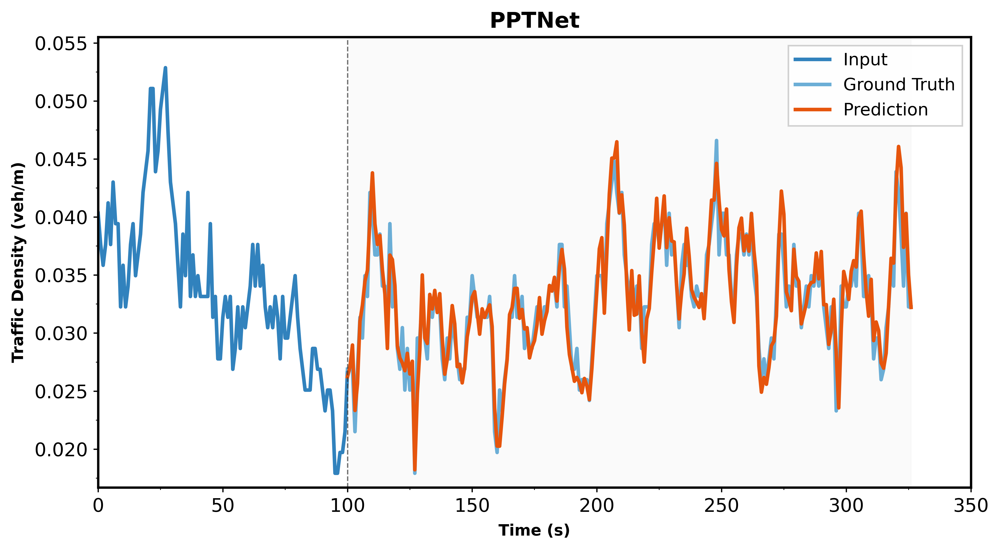
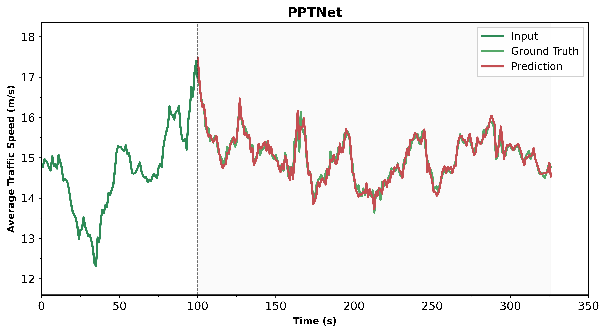
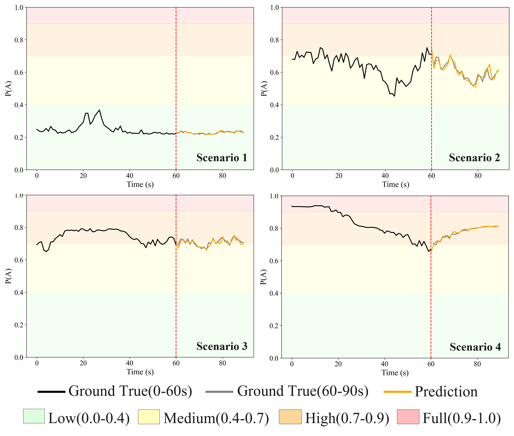

# PPTNet: A Hybrid Periodic Pattern-Transformer Architecture for Traffic Flow Prediction and Congestion Identification

<p align="center">
  
</p>

---

## Introduction
Accurate prediction of traffic flow parameters and real-time identification of congestion states are essential for the efficient operation of intelligent transportation systems. This paper proposes a Periodic Pattern-Transformer Network (PPTNet) for traffic flow prediction, integrating periodic pattern extraction with the Transformer architecture, coupled with a fuzzy inference method for real-time congestion identification. Firstly, a high-precision traffic flow dataset (Traffic Flow Dataset for China’s Congested Highways \& Expressways, TF4CHE) suitable for congested highway scenarios in China is constructed based on drone aerial imagery data. Subsequently, the proposed PPTNet employs Fast Fourier Transform to capture multi-scale periodic patterns and utilizes two-dimensional Inception convolutions to efficiently extract intra and inter periodic features. A Transformer decoder dynamically models temporal dependencies, enabling accurate predictions of traffic density and speed. Finally, congestion probabilities are calculated in real-time using the predicted outcomes via a Mamdani fuzzy inference-based congestion identification module. Experimental results demonstrate that the proposed PPTNet significantly outperforms mainstream traffic prediction methods in prediction accuracy, and the congestion identification module effectively identifies real-time road congestion states, verifying the superiority and practicality of the proposed method in real-world traffic scenarios.

<p align="center">
  
</p>

---

## Environments

- python 3.9, pytorch 2.5.1,  CUDA 12.4

```python
git clone https://github.com/ADSafetyJointLab/PPTNet.git
conda create -n pptnet python=3.9.20
conda activate pptnet
pip install -r requirements.txt
```
---
## Dataset
The **TF4CHE** (Traffic Flow Dataset for China’s Congested Highways & Expressways) is derived from the UAV-based **AD4CHE** dataset, calibrated to approximately 5 cm accuracy at 100 m altitude. TF4CHE is pre-processed into a consolidated time-series format suitable for traffic flow prediction and congestion identification.

- **Coverage**  
  - **11 road segments** (`Road_segment_1.csv` … `Road_segment_11.csv`), each corresponding to a distinct expressway section in five Chinese cities (originally 68 AD4CHE segments, consolidated by route).  
  - **Lane layout:** Four travel lanes + emergency lane in each direction; world coordinate origin at top-left of UAV frame, X increasing in travel direction, Y downward.

- **File format**  
  Each `Road_segment_{i}.csv` contains one row per second, with the following columns:

| Name               | Description                                                                               | Unit      |
|--------------------|-------------------------------------------------------------------------------------------|-----------|
| Month/Year         | Month and year of video recording (virtual date information)                              | –         |
| Weekday            | Completion date of video recording (virtual date information)                             | –         |
| TimeCode           | Specific start time of video recording (virtual time information)                         | –         |
| second             | Video time sequence in seconds                                                            | s         |
| drivingDirection   | Traveling direction of the recorded segment                                               | –         |
| car                | Number of cars in frame                                                                   | veh       |
| bus                | Number of buses in frame                                                                  | veh       |
| truck              | Number of trucks in frame                                                                 | veh       |
| G(t)               | Equivalent vehicle count, with cars as the reference, (conversion coefficients: $\alpha_{\text{bus}} = 2,\ \alpha_{\text{truck}} = 2.5$)     | veh       |
| k(t)               | Average density                                                                            | veh/m     |
| q(t)               | Average flow                                                                               | veh/s     |
| xVelocity(t)       | Mean speed along X-axis                                                                    | m/s       |
| yVelocity(t)       | Mean speed along Y-axis                                                                    | m/s       |
| xAcceleration(t)   | Mean acceleration along X-axis                                                             | m/s²      |
| yAcceleration(t)   | Mean acceleration along Y-axis                                                             | m/s²      |
| OccupancyRatio     | Lane space occupancy                                                                       | –         |
| File_ID            | Original AD4CHE segment index                                                              | –         |


> **Note:** TF4CHE converts per-frame trajectory data (`xx_tracks.csv`) and metadata (`xx_recordingMeta.csv`, `xx_tracksMeta.csv`) into uniformly spaced time-series, applying conversion formulas from rail transit theory to compute densities, flows, and occupancy, thus streamlining downstream forecasting tasks.


- **Downloads**  
  We provide download link from Google Drive and Baidu Yunpan to facilate users from all over the world.
  - **[Baidu Yunpan](https://pan.baidu.com/s/170RxFKCbPo0PCzDMVRyFNw?pwd=xrvr)**&emsp;Extraction code&nbsp;:&nbsp;`xrvr`
  - **[Google Drive](https://drive.google.com/file/d/1ez4AZ3MwptR3wzw0nWTzKQ0iYbprS7n-/view?usp=sharing)**
 
- **Preparation**  
  You should refer to the `preprocess.py` and change your `input_dir`、`utput_dir` path. And divide the original TF4CHE dataset into 'train', 'val', and 'test'.
```python
python preprocess.py
```

<p align="center">
  
</p>

---

## Train

You should refer to the `config.py` and change your `raw_data_path`、 `processed_data_path` and `pred_dir` path. And start predicting network training

```python
python train.py
```
---
## Results

### Prediction
#### Performance comparison between PPTNet and mainstream prediction models at different prediction horizons  

*<strong>Bold</strong> denotes the best result, <u>underline</u> denotes the best result of previous methods, &uarr; denotes performance improvement, and &darr; denotes performance degradation.*

| Model | MAE&nbsp;@15 | MSE&nbsp;@15 | RMSE&nbsp;@15 | MAE&nbsp;@30 | MSE&nbsp;@30 | RMSE&nbsp;@30 | MAE&nbsp;@45 | MSE&nbsp;@45 | RMSE&nbsp;@45 |
|-------|-------------|-------------|--------------|-------------|-------------|--------------|-------------|-------------|--------------|
| LSTM | 0.1719 | 0.0477 | 0.2184 | 0.2517 | 0.0954 | 0.3088 | 0.2911 | 0.1179 | 0.3433 |
| RNN | 0.1528 | 0.0316 | 0.1776 | 0.2747 | 0.0997 | 0.3157 | 0.2993 | 0.1201 | 0.3465 |
| ConvLSTM | 0.1362 | 0.0236 | 0.1535 | 0.2372 | 0.0772 | 0.2779 | 0.2747 | 0.1010 | 0.3179 |
| Bi‑LSTM | 0.1703 | 0.0410 | 0.2024 | 0.1908 | 0.0544 | 0.2331 | 0.2425 | 0.0929 | 0.3084 |
| GRU | 0.1106 | 0.0184 | 0.1356 | 0.1816 | 0.0442 | 0.2102 | 0.2060 | 0.0606 | 0.2462 |
| CNN | 0.1117 | 0.0166 | 0.1287 | 0.1623 | 0.0345 | 0.1857 | 0.1666 | 0.0358 | 0.1891 |
| TCN | 0.1036 | 0.0174 | 0.1319 | 0.0934 | 0.0151 | 0.1230 | 0.1547 | 0.0374 | 0.1934 |
| ConvGRU | 0.0883 | 0.0119 | 0.1091 | 0.1224 | 0.0202 | 0.1420 | 0.1061 | 0.0167 | 0.1291 |
| LSSL | 0.0859 | 0.0095 | 0.0973 | 0.0763 | 0.0078 | 0.0882 | 0.1333 | 0.0237 | 0.1539 |
| Transformer | 0.0946 | 0.0125 | 0.1117 | 0.0677 | 0.0069 | 0.0828 | 0.1379 | 0.0296 | 0.1721 |
| Reformer | 0.0955 | 0.0110 | 0.1049 | 0.0558 | 0.0044 | 0.0664 | 0.0711 | 0.0073 | 0.0854 |
| FEDformer | 0.0973 | 0.0087 | 0.0934 | 0.0566 | 0.0048 | 0.0693 | 0.0670 | 0.0065 | 0.0809 |
| LSTNet | 0.0856 | 0.0094 | 0.0972 | <ins>0.0523</ins> | <ins>0.0040</ins> | <ins>0.0633</ins> | 0.0645 | 0.0059 | 0.0768 |
| TimesNet | **<ins>0.0778</u>** | <ins>0.0085</ins> | <ins>0.0925</ins> | 0.0573 | 0.0048 | 0.0690 | **<ins>0.0615</ins>** | <ins>0.0056</ins> | <ins>0.0746</ins> |
| **PPTNet&nbsp;(Ours)** | 0.0821 | **0.0074** | **0.0861** | **0.0512** | **0.0033** | **0.0574** | 0.0660 | **0.0050** | **0.0709** |
| *Improvement&nbsp;(%)* | &darr; 5.53 | &uarr; 12.94 | &uarr; 6.92 | &uarr; 2.10 | &uarr; 17.50 | &uarr; 9.32 | &darr; 7.32 | &uarr; 10.71 | &uarr; 4.96 |


<p align="center">
  
  
</p>

### Congestion Identification
<p align="center">
  
</p>


