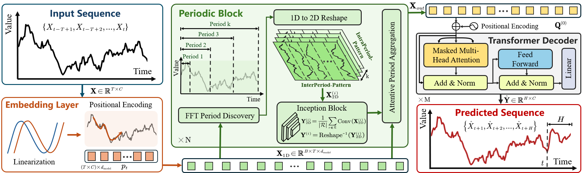

# PPTNet: A Hybrid Periodic Pattern-Transformer Architecture for Traffic Flow Prediction and Congestion Identification

<p align="center">
  
</p>

---

## Introduction

**Abstract:**

> Accurate prediction of traffic flow parameters and real-time identification of congestion states are essential for the efficient operation of intelligent transportation systems. This paper proposes a Periodic Pattern-Transformer Network (PPTNet) for traffic flow prediction, integrating periodic pattern extraction with the Transformer architecture, coupled with a fuzzy inference method for real-time congestion identification. Firstly, a high-precision traffic flow dataset (Traffic Flow Dataset for China’s Congested Highways \& Expressways, TF4CHE) suitable for congested highway scenarios in China is constructed based on drone aerial imagery data. Subsequently, the proposed PPTNet employs Fast Fourier Transform to capture multi-scale periodic patterns and utilizes two-dimensional Inception convolutions to efficiently extract intra and inter periodic features. A Transformer decoder dynamically models temporal dependencies, enabling accurate predictions of traffic density and speed. Finally, congestion probabilities are calculated in real-time using the predicted outcomes via a Mamdani fuzzy inference-based congestion identification module. Experimental results demonstrate that the proposed PPTNet significantly outperforms mainstream traffic prediction methods in prediction accuracy, and the congestion identification module effectively identifies real-time road congestion states, verifying the superiority and practicality of the proposed method in real-world traffic scenarios.

<p align="center">
  
</p>

---

## Environments

- python 3.9, pytorch 2.5.1,  CUDA 12.4

```python
git clone https://github.com/ADSafetyJointLab/PPTNet.git
conda create -n pptnet python=3.9.20
conda activate pptnet
pip install -r requirements.txt
```
